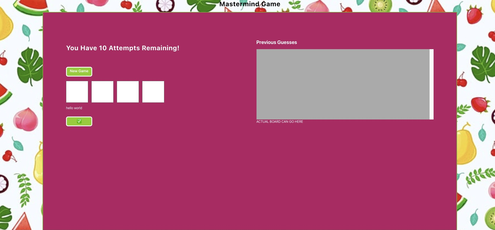
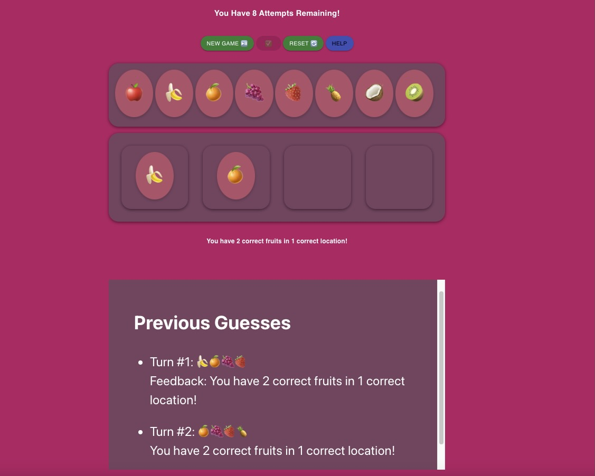

🟠 `Mastermind Game`

"Mastermind" is a game that can be played "against" the computer. In this game, the user tries to guess a number combination. At the end of each attempt to guess the 4 number comination, the computer will provide feedback whether the player had guessed a number correctly, and/or the number index correctly. A player must get the number comination right within 10 attempts to win the game!

In this version of the game, however, the numbers are represented by fruits. The user will have to guess the combination of 4 random fruits out of 8. It can actually make the game seem a little easier, and a lot more fun.

🟠 `Running the project on your machine`

The first step to running this app locally is cloning the repository (https://github.com/FioraDeMarco/mastermind-game.git)

You then go into your terminal and paste the clone into an empty directory. You then cd into the directory and don't forget to run npm i or npm install from the root of this directory.

$cd [your directory]
$ git clone https://github.com/FioraDeMarco/mastermind-game.git
$npm install

After intallation is complete, in the project directory, you can run:

🟠 `npm start`

$npm start

Runs the app in the development mode.
Open [http://localhost:3000](http://localhost:3000) to view it in your browser.

<h2 align-items="center">
🟠   About this game
</h2>

To play, you can select a difficulty level. Then you drop your guesses into the slots, and press check to see your feedback beneath. If you need to hear the directions again, there is a "help" button.

In the early stages of this project, I wanted to make sure that I had covered all the bases and was able to get a viable MVP up and running. After much planning, I developed the game in the format of receiving numerical input through a form.

This is an image of the initial rough draft

 
After testing the game and it's functionality, I decided to take it further and implement react-dnd drag and drop functionality to receive user input.
 

 
<h2 align-items='center'>
🟠 Project requirements:
</h2>
Generate 4 random numbers using Random.org API
User is able to enter a guess for the combination
User is able to view the history of their guesses
The number of guesses remaining is displayed

<h2 align-items='center'>
🟠 Extensions
</h2>
~Add a configurable difficulty level: In this game a user is able to choose from 3 difficulty levels, easy, medium, or hard. The game is defaulted to medium. (Easy level is intended for children)

~ There is a backup number generator included for times where the api may fail

~ This game also includes a little celebration when the user guesses the combination right, and lets the user down easy if they don't.

Tech stack, Material UI, React, Toastify

Axios is used to call the random.org api.

There are a few things I could have improved on this project. One is the fact that I want to add a scoring system which could operate locally as the guess history does, Another is that I do want to incorporate a supabase database to save scores and allow users to play against each other.

<h2 align-items="center">
I had a lot of fun making this game and I hope you enjoy it!
</h2>

🟠 `Learn About Create React App`

You can learn more in the [Create React App documentation](https://facebook.github.io/create-react-app/docs/getting-started).

To learn React, check out the [React documentation](https://reactjs.org/).
